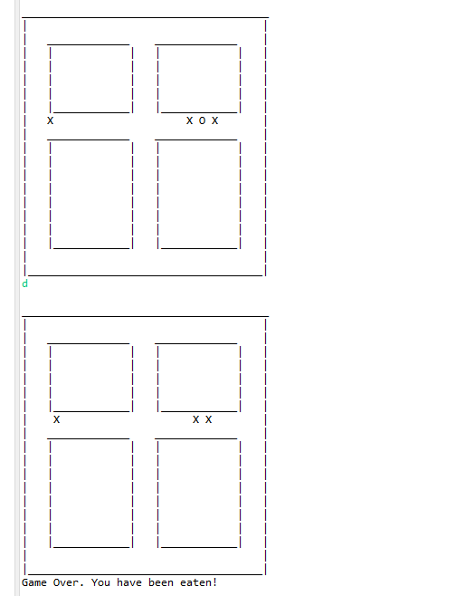

# AStarGame

### Problem Prompt
Write a Pac-Man liked game. The game board is tiled. The movement of Pac-Man is to be controlled by the game player and the movement of the ghost(s) is to be controlled by the program.  Both Pac-Man and the ghost(s) can only move up, down, left, or right one tile position at a time.  No diagonal movement is allowed. Design an A* path finding algorithm to help the ghost(s) to catch Pac-Man.  Describe the heuristics used in the A* algorithm.

The program runs a text based game, to attempt to escape as long as possible.
Controls are w,a,s,d for up, left, down, and right

The enemies use an A* method to determine the direction they should chase you!
Potential moves are judged based on the manhattan distance from the target, with the closest one evaluated first. 
https://en.wikipedia.org/wiki/Taxicab_geometry

Additionally, there is a 20% chance each turn for an individual enemy to be unable to move, to add some randomness, and simulate slower enemies.

Try not to be eaten!

